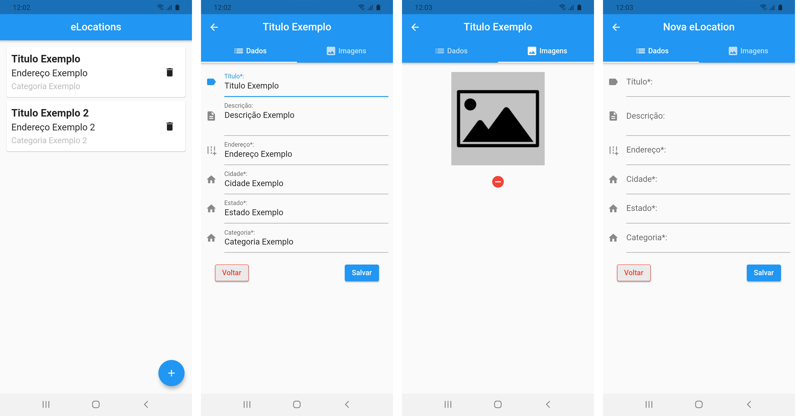

# eLocations
<br />

<p align="center">A Flutter and Dart challenge for a Internship vacancy</p>

<h4 align="center"> 
	🚧  eLocations 🚀 Under construction  🚧
</h4>

---

## Features

- [X] HomePage with previous registered eLocations
- [X] Add Button in HomePage calling New eLocationPage
- [X] Add Image Button in ElocationPage calling AppCamera
- [X] Tap a record to edit it
- [X] Delete record button working

---

## App Preview
<p>

</p>

---

## Developer Quick start

1. [Install Pre-requisites](#pre-requisites)
1. [Clone](#clone-the-repo)
1. [Download third party libs](#download-third-party-libs)
1. [Run eLocations](#run-eLocations-on-a-device-or-simulator)


### Pre-requisites

* Install [Flutter SDK](https://flutter.dev/docs/get-started/install).
* Make sure you're on Flutter's beta channel. To know what channel you're on, run ```flutter channel``` on Terminal/Bash.
* Setup your [favorite code editor](https://flutter.dev/docs/get-started/editor) (I recommend using [VS Code](https://code.visualstudio.com/))

### Clone the repo
    git clone git@github.com:alex-cerlini/eLocations.git


### Download Third Party Libs
1. run ```flutter packages get``` to download all the librarys used in project


### Run eLocations on a device or simulator
* Run `flutter run` with a device attached to your computer or an open simulator
or
* Use your editor command to run the app (F5 in Visual Studio Code)

---

## Technology
- Dart
- Flutter

## Author
---

<a href="https://github.com/alex-cerlini">
 
 <br />
 <sub><b>Alexander Andrade Cerlini</b></sub></a> <a href="https://github.com/alex-cerlini" title="Alex Cerlini">🚀</a>


Feito com <span style="color: red">♥</span>.
<br/>Obrigado Engeselt pelo desafio!

[](https://www.linkedin.com/in/alexander-andrade-cerlini-560982119/) 
[](mailto:alexcerlinii@gmail.com)